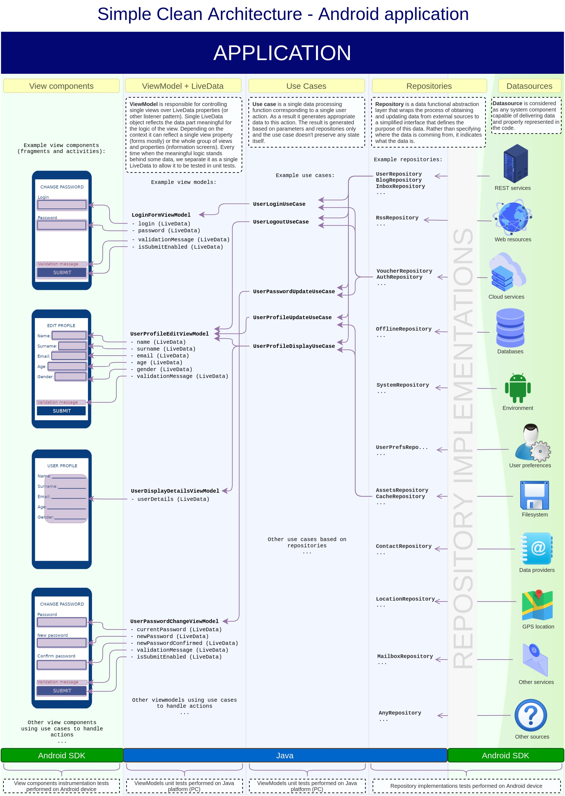

# Simple Clean Architecture - Android Example

### About
This is just a raw example of some clean architecture implementations. The main assumption of the project is to be as simple as possible,
but also provide layers possible to be tested by unit tests. 

### Main advantages of this architecture:
- viewmodel and use case layers testable by unit test
- clear separation of logic from the layout
- the whole logic is represented by simple data, making it easier to track it
- functional approach to simplify the code
- minimal view logic, reduced to a layout with a set of listeners
- clear separation of concerns
- minimal and unified set of architecture components

### Practical/pragmatic remarks:
- it's hard to completely avoid references to Android classes in any part of code as sometimes there is just no effective way to reconcile
  the functional requirements (e.g. Parcelable data classes, libraries dependencies). As the main purpose is to write testable code,
  I'd consider it acceptable, as long as unit tests work and we don't need to call Android SDK methods during tests - please refer to:
  https://developer.android.com/training/testing/unit-testing/local-unit-tests#mocking-dependencies
  In other words: the purest structure we mantain, the less problems and bugs we have, but if we need to write own version of huge external library to achieve
  the Android SDK separation, maybe making exception would be a better choice.
- TODO: other remarks
